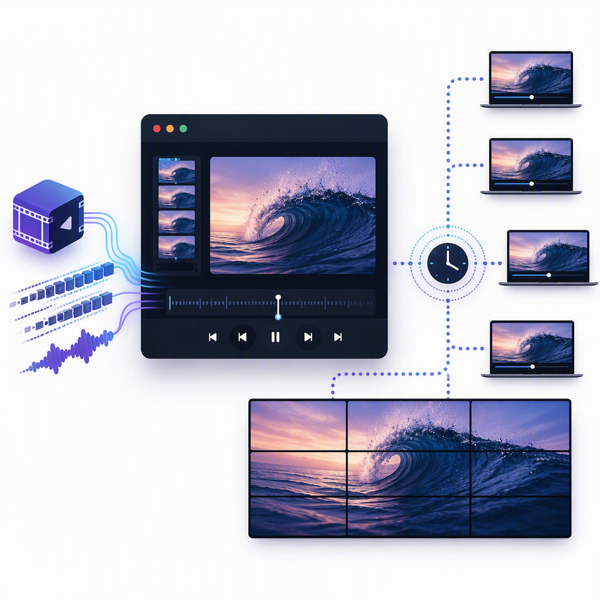
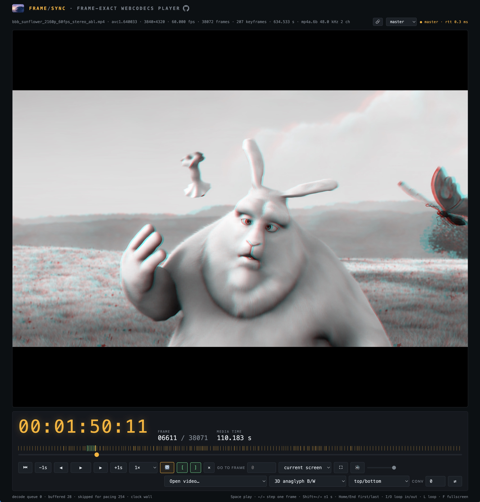

# FrameSync — frame-exact WebCodecs player

<p align="center">
  
</p>

A web page that plays MP4 video (with audio) with **frame-exact** seeking,
stepping, and timing readout — and synchronizes any number of clients to a
shared clock, up to tiled video-wall deployments. Built directly on the
modern low-level web media stack:

- **WebCodecs** (`VideoDecoder`, `AudioDecoder`, `VideoFrame`,
  `EncodedVideoChunk`) — the page owns the decode pipeline instead of
  trusting `<video>.currentTime`.
- **MP4Box.js v2.4.1** (vendored as an ES module in `js/mp4box/`) — demuxes
  the MP4 into a full sample table held in memory, so every frame is
  addressable.
- **Canvas 2D** — each `VideoFrame` is drawn explicitly; nothing is
  interpolated or dropped silently.
- **Web Audio** — decoded AAC is scheduled sample-accurately on the
  `AudioContext` timeline.
- **WebGPU** — WGSL shaders filter every frame with no readback: each
  `VideoFrame` becomes a `GPUExternalTexture`, including row-interleaved,
  anaglyph, and single-eye **stereo 3D** from side-by-side or top/bottom
  sources.

## Run it

```sh
node server.js          # default port 8417
# open http://localhost:8417/
```

The zero-dependency Node server serves the static files and provides the
`/sync` WebSocket plus a `/status` JSON endpoint. For a single solo player
any static server works — there is still no build step (the app is classic
scripts; mp4box v2 loads as a native ES module, so `file://` no longer
works — serve over HTTP).

### Docker

```sh
docker build -t framesync .
docker run -d -p 8417:8417 -v /path/to/your/videos:/app/videos:ro framesync
```

Mounted media is served read-only and loads as `?src=videos/<file>`; the
two ground-truth test clips are baked into the image (`?src=test/…`). Or
`docker compose up` with the included `docker-compose.yml`, which mounts
`./videos`. A `/status`-based healthcheck is built in.

Drop any MP4/MOV (H.264, HEVC*, VP9, AV1 — whatever the browser's decoder
supports) onto the stage, or use the **Open video…** picker, which lists
three sources in one menu: **server media** (every video file under the
server root — `GET /media` serves the listing; picking one loads by URL, so
followers auto-load it too), **recent local files** (Chromium: File System
Access handles persisted in the browser — reopening asks a one-click read
permission per session; drag-and-dropped files join the list), and
**Browse…** for the native file picker. Requires Chrome/Edge 94+,
Safari 16.4+, or Firefox 130+.

## Why this is frame-exact

- The demuxer builds a **presentation-order frame table**: every sample's
  composition timestamp (µs), sorted. "Frame N" means exactly the Nth entry —
  correct even with B-frame reordering and variable frame rate.
- **Seeking to frame N**: reset the decoder, re-enter the bitstream at the
  nearest sync sample at-or-before N in decode order, decode forward, and
  discard every output below frame N's timestamp. The displayed frame is
  frame N — never a neighbour, which is what `video.currentTime = t` gives you.
- **Stepping** consumes the decoded frame queue one `VideoFrame` at a time
  (backwards = seek to N−1).
- Composition-time offsets from B-frame files (raw `ctts`, normally masked by
  the edit list) are normalized so frame 0 presents at exactly t = 0.
- Playback is paced by mapping `performance.now()` onto media timestamps. If
  *rendering* falls behind, frames are skipped to stay on clock (counted in
  the footer as "skipped for pacing"); if the *decoder* falls behind, the
  clock rebases so no frame is ever silently lost.

The amber strip above the scrubber plots every **keyframe** (sync sample) in
the file — the real random-access structure that determines seek cost.

## GPU filters (WebGPU)

The filter dropdown applies a WGSL shader to every frame — grayscale, sepia,
invert, and swirl (a coordinate warp: the image rotates around the centre
with a smooth radial falloff) — with an amount slider (100 % = the filter's
natural strength; swirl turns a half-rotation at the centre). The pipeline is
zero-copy: each decoded `VideoFrame` is imported as a `GPUExternalTexture`
(no readback, no upload), filtered into an offscreen canvas, and blitted by
the normal draw path, so filters compose with tiling, contain fit, and
fullscreen unchanged.
The filter is part of the synced state: setting it on the master applies it
to every follower. Without WebGPU the controls disable and playback is
unfiltered.

### Stereo 3D

Five **techniques** consume a frame-packed stereo pair. Which technique to
use and how the source packs the pair are independent choices, so they are
two menus rather than one entry per combination: picking anything from the
filter dropdown's **stereo pair** group reveals a **layout** menu beside it,
plus the ⇄ **swap eyes** button (for displays whose polarization phase — or
glasses whose colours — run the other way round; it also exchanges which
half the single-eye views show). None of them use the amount slider, which
hides itself.

Layouts, all emitting one eye at its native geometry:

| layout | source frame | eyes | output |
| --- | --- | --- | --- |
| **side-by-side** | 2W × H | left beside right, native width | W × H, mapped 1:1 |
| **half side-by-side** | W × H | squeezed 2× horizontally | W × H, un-squeezed |
| **top/bottom** | W × 2H | left above right, native height | W × H, mapped 1:1 |

Techniques:

- **3D interlace** — row-interleaved for passive 3D displays: **even rows
  from the left eye, odd rows from the right**, each sampled at the same
  position in its own half so the eyes stay aligned.
- **3D anaglyph B/W** — the classic monochrome red/cyan: each eye's Rec.709
  luma into its own channel (left → red, right → green+blue). No colour, but
  the least retinal rivalry and ghosting of any method, and the safest choice
  for saturated content.
- **3D anaglyph Dubois** — a least-squares projection of the stereo pair
  onto what red/cyan glasses can actually transmit, applied as a per-eye 3×3
  matrix (published sRGB coefficients) and summed. Keeps far more usable
  colour than naive channel separation while staying comfortable; extreme
  colours clamp. Identical eyes reproduce near-neutral grey, so mono content
  looks normal through the glasses.
- **left eye only** / **right eye only** — one eye of the pair as ordinary
  2D, un-squeezed to its native geometry. No glasses, no display
  requirements: it is the quickest way to confirm the layout and eye order
  are right, to play 3D material on a 2D wall, and to compare the two eyes
  by toggling between them.

The anaglyphs and the single-eye views need no pixel alignment, so they
scale and letterbox freely, unlike the interlace.

Stereo runs before the crop/fit stage, so it composes with tiling — and the
filter choice, layout, and eye swap all ride in the synced state, so one
master drives a whole 3D wall (`?filter=stereo&slayout=tb&swapeyes` for
kiosk launches).

**Pixel alignment is everything for the interlace**: interleaving only works if output row
N lands on physical display row N. Any scaling destroys the effect, so the
per-eye resolution must match the display's, the page must run fullscreen at
native resolution, and tiled walls should use `fit=fill` rather than a
letterboxing fit. The canvas is set to `image-rendering: pixelated` while
the interlace is active so residual scaling cannot blend adjacent eye rows;
the other stereo modes leave it off, since they want smooth scaling.

## Audio and the clock hierarchy

During 1× playback the **audio hardware clock is the master**: decoded AAC
frames become `AudioBufferSourceNode`s scheduled at exact context times
(chained by float duration so µs rounding never opens clicks), and the video
render loop paces itself against `AudioContext.currentTime` mapped back to
media time. That is the only way lips and sound stay together over minutes.
The stats footer shows which clock is driving (`clock audio` / `clock wall`).

Consequences of that hierarchy:
- Pause, stepping, and scrubbing are silent and stay frame-exact
  (wall/no clock — video truth).
- Seeking while playing restarts audio at the new frame's timestamp.
- At rates other than 1× audio is disabled and the wall clock paces video.
- If the video decoder ever falls behind during audio playback, audio
  continuity wins and video catches up (skips are counted); with the wall
  clock the opposite choice is made — the clock rebases so no frame is lost.

The stsd channel count in MP4s is unreliable, so the demuxer parses the AAC
AudioSpecificConfig for the true sample rate and channel count, and track
timestamps are normalized through the edit list (`elst`), which is what
aligns B-frame composition offsets on video and encoder priming on audio.

`window.vsPlayer` / `window.vsAudio` are exposed for console experiments.

## Multi-client sync

Open the page on any number of machines pointing at the same server and give
each a role (header dropdown, or URL params):

```
http://SERVER:8417/?role=master&src=test/frames-30fps-audio.mp4
http://SERVER:8417/?role=follower&fullscreen
```

Followers auto-load whatever file the master announces (when it was loaded
by URL — `?src=` or a synced path), lock their transport controls, and slave
their render clock to the master. Play, pause, seek, step, and rate changes
on the master drive everyone.

How it works — the transport (a WebSocket) matters less than the design:

- **Shared clock.** Each client estimates the server's microsecond clock
  NTP-style (offset of the minimum-RTT sample). On a LAN this agrees to well
  under 1 ms — ~30× tighter than one frame at 30 fps.
- **Declarative state, not commands.** The master broadcasts
  `{mediaTimeUs, atSharedUs, rate, playing, src, seq}` (on every transport
  action, re-anchored every 500 ms). Followers evaluate
  `mediaTimeUs + (sharedNow − atSharedUs) × rate` locally each frame, so
  message latency cancels out entirely: a client that receives state late —
  or reconnects after an outage — lands on the same frame as everyone else
  with a single message.
- **Clock hierarchy on a follower**: sync > wall. Audio is silenced
  (independent DACs cannot share a clock); play audio on one designated node
  (the master, whose own clock is its audio hardware — the periodic
  re-anchor transmits that clock to the followers).
- `GET /status` reports each client's displayed frame and its deviation from
  the master mapping, measured in the shared clock domain — transport
  latency does not pollute the measurement.
- **Master liveness & arbitration.** Master ownership is granted by the
  server (last claim wins, token-stamped). If the master disconnects — or
  goes silent past 3 s, e.g. a hung machine — the server freezes the
  timeline: it extrapolates the mapping to "now", broadcasts it as a paused
  state, and notifies everyone (followers show `MASTER LOST`; late joiners
  inherit the frozen frame instead of a runaway ghost timeline). Opening a
  new `?role=master` takes over instantly; the previous master is demoted
  (its page flips to follower) and its stale anchors are rejected, so two
  masters can never fight over the timeline.
- **Master adoption.** A master that (re)joins while a timeline exists does
  not reset it: it loads the announced file if needed, seeks to the mapped
  current position, resumes playing if the wall was playing, and only then
  starts anchoring. Killing and reopening the master page mid-show costs a
  sub-200 ms nudge, not a restart from zero.

Measured on localhost with the beep test clip: a visible follower tracks
within one frame period (≲33 ms); on pause every client converges to the
identical frame (error 0.0 ms).

## URL parameters

| Param | Meaning |
|---|---|
| `role=master` / `role=follower` | sync role (default: solo) |
| `src=test/foo.mp4` | server-relative file to load at startup |
| `loop` | loop at end of file |
| `fullscreen` (or `fs`) | stage fullscreen — video only, cursor hidden |
| `screen=N` | display index fullscreen targets (Window Management API) |
| `filter=name` + `famount=1.0` | GPU filter at load (grayscale, sepia, invert, swirl, stereo, anaglyph, anaglyph-dubois, left-eye, right-eye) |
| `slayout=sbs\|half-sbs\|tb` | stereo source layout (default `sbs`) |
| `swapeyes` | start any stereo mode with the eyes swapped |
| `tile=col,row,cols,rows` | show one grid slice of the wall (tiled mode) |
| `crop=x,y,w,h` | show an arbitrary normalized rect (bezel compensation) |
| `fit=contain` / `fit=fill` | aspect-fit the video into the wall (default with `tile`) vs stretch the slice |
| `wall=cols,rows` | wall geometry for `fit=contain` when using `crop` |

## Wall deployment

A typical wall node — follower, one grid slice, fullscreen on a chosen
display:

```
http://SERVER:8417/?role=follower&tile=1,0,4,2&fullscreen&screen=0
```

- **Tiling** (`tile`, `crop`) crops at blit time only: every node decodes
  the full stream (bitstreams are not spatially separable), then draws its
  slice — no extra decode cost, no interaction with sync. Grid slices from
  `tile` are exact fractions, so adjacent tiles meet seamlessly; use `crop`
  insets to compensate for monitor bezels.
- **Aspect** is preserved by default: with `fit=contain` (implied by
  `tile`) the video is aspect-fitted into the wall's *combined* surface —
  one global letterbox/pillarbox decision, computed identically by every
  node (from its grid position and its monitor's aspect), so the bars align
  across the wall and the picture is never distorted. `fit=fill` stretches
  each slice edge-to-edge instead, for content whose aspect already matches
  the wall. Bare `crop` keeps its source-crop meaning under `fill`; with
  `fit=contain` it is treated as the tile's wall rect (pass `wall=cols,rows`
  so the node knows the wall's shape).
- **Fullscreen** needs a user gesture: if the immediate request on load is
  refused, the first click or keypress triggers it (⛶ / F toggle any time).
  `screen=N` and the display selector next to ⛶ need the one-time
  window-management permission (Chromium). Unattended nodes skip all of
  this by launching the browser with `--start-fullscreen` or `--kiosk`.
- **Secure context**: WebCodecs (and the Window Management API) only exist
  in secure contexts. `http://localhost` qualifies; other machines hitting
  `http://SERVER:8417` do not — serve HTTPS (e.g. mkcert), put a
  TLS-terminating reverse proxy in front, or launch Chrome on each node with
  `--unsafely-treat-insecure-origin-as-secure=http://SERVER:8417`.
- **Reverse proxy**: the app can live under a path prefix (the sync
  WebSocket URL is resolved relative to the page). The proxy must strip the
  prefix and forward WebSocket upgrades — nginx:

  ```nginx
  location = /framesync { return 301 /framesync/; }
  location /framesync/ {
    proxy_pass http://127.0.0.1:8417/;   # trailing slash strips the prefix
    proxy_http_version 1.1;
    proxy_set_header Upgrade $http_upgrade;
    proxy_set_header Connection "upgrade";
  }
  ```

  No base path is configured in the app: relative URLs plus a runtime
  `<base>` shim make it self-locating, with or without the trailing slash.

  (Caddy: `handle_path /framesync/* { reverse_proxy 127.0.0.1:8417 }` —
  WebSockets are forwarded automatically.)
- **Throttling**: Chrome suspends rendering (and eventually freezes JS) in
  hidden/occluded pages. A hidden follower degrades to coarse ~1 s tracking
  via a fallback timer and resyncs exactly the moment it is visible again.
  Run wall pages fullscreen and add `--disable-backgrounding-occluded-windows`.
  Tabs playing audio (the master) are exempt from freezing.

A complete node launch line:

```sh
chrome --app="http://SERVER:8417/?role=follower&tile=1,0,4,2&fullscreen" \
  --start-fullscreen --disable-backgrounding-occluded-windows \
  --unsafely-treat-insecure-origin-as-secure=http://SERVER:8417
```

### Example: a wide movie across 2 monitors

One machine, two side-by-side monitors — a 2×1 grid. Simplest setup: the
master is also the left tile (its keyboard transport keeps working in
fullscreen, and audio plays from it):

```
http://localhost:8417/?role=master&src=test/bbb.mp4&tile=0,0,2,1&fullscreen&screen=0
http://localhost:8417/?role=follower&tile=1,0,2,1&fullscreen&screen=1
```

Open each URL in its own Chrome **window** (hidden tabs freeze); the first
click in each satisfies the fullscreen gesture and, once, the display
permission. To keep the timecode console visible instead, run a third
windowed page as `?role=master&src=…` and make both tiles followers.

Aspect: two 16:9 monitors form a 32:9 surface, and the default
`fit=contain` aspect-fits the movie into it — a 16:9 movie shows centered
across both monitors with pillarbox bars on the outer edges, a 2.39:1
scope movie with narrower bars, true 32:9 content edge-to-edge with none.
Add `fit=fill` to stretch instead.

## Verify it yourself

<p align="center">
  
</p>

`test/frames-30fps.mp4` is a 300-frame, 30 fps H.264 clip (GOP 60, B-frames)
with the frame number burned into every frame. Load it, scrub anywhere, step
with ←/→: the burned-in `FRAME n` must always match the FRAME readout.
`test/frames-30fps-audio.mp4` adds an AAC track with a 1 kHz beep at every
second boundary — each beep must land exactly as frames 0, 30, 60, … display.
Regenerate the base clip with:

```sh
ffmpeg -f lavfi -i "testsrc2=size=1280x720:rate=30:duration=10" \
  -vf "drawtext=fontfile=/System/Library/Fonts/Supplemental/Arial.ttf:\
text='FRAME %{n}':x=(w-tw)/2:y=(h-th)/2:fontsize=96:fontcolor=white:\
box=1:boxcolor=black@0.7:boxborderw=20" \
  -c:v libx264 -pix_fmt yuv420p -g 60 -bf 2 test/frames-30fps.mp4
```

## Controls

| Input | Action |
|---|---|
| Space | play / pause |
| ← / → | step one frame |
| Shift+← / Shift+→ | jump ±1 s |
| ⏮ / Home | restart from the first frame |
| End | last frame |
| scrubber | frame-accurate scrub (1 frame per step) |
| Go to frame + Enter | jump to an exact frame index |
| 🔁 / L | loop at end of file |
| ⛶ / F | fullscreen (stage only) |
| filter dropdown | GPU filter (grayscale, sepia, invert, swirl, stereo 3D, single eye) |
| layout dropdown | stereo source layout — SBS, half SBS, top/bottom (3D filters only) |
| amount slider | filter strength (hidden for stereo modes) |
| ⇄ | swap left/right eye (stereo filters) |

## Files

- `index.html` — UI (no build step, no external requests)
- `server.js` — zero-dep Node: static files, `/sync` WebSocket, `/status`
- `js/mp4box/` — vendored MP4Box.js v2.4.1 (native ES module, bridged to `window.MP4Box`)
- `js/demuxer.js` — MP4Box wrapper → decoder configs + sample tables (video + audio)
- `js/player.js` — `FramePlayer`: decode pipeline, clock hierarchy, seek/step logic
- `js/audio.js` — `AudioEngine`: AudioDecoder → sample-accurate Web Audio scheduling
- `js/gpufilter.js` — `GPUFilter`: WebGPU/WGSL filter stage, incl. stereo 3D
- `js/syncclient.js` — `SyncClient`: NTP-style shared clock + state exchange
- `js/main.js` — UI wiring, GOP strip, keyboard transport, sync roles
- `docs/` — artwork: architecture illustration, UI screenshot, header image
  and the square favicon crop

## Current limitations

- Audio codecs: AAC (`mp4a.40.x`, including QuickTime-style sample entries
  with the `esds` nested in a `wave` box or missing entirely — the config is
  repaired from the mdhd timescale and a minimal AudioSpecificConfig is
  synthesized) and MP3-in-MP4 (`mp4a.6b`/`.69`, remapped to WebCodecs'
  `mp3`). With several audio tracks the most decodable one is chosen
  (AAC > MP3 > Opus/FLAC > AC-3). An unsupported or mid-stream-failing
  audio track degrades to silent playback — video and sync are unaffected.
  Opus-in-MP4 would still need `dOps` description extraction.
- Whole file is held in memory (that's what makes random access instant);
  fine up to a few GB, not for streaming. For streaming, the same pipeline
  works with incremental `appendBuffer` + on-demand sample windows.
- MP4/MOV containers only (WebM would need a different demuxer, e.g. jswebm).
- Timecode display assumes constant frame rate (non-drop-frame); the frame
  index and media time are always exact regardless.
- HEVC support depends on platform decoders (Safari yes; Chrome only where
  the OS provides it).
- Stereo sources must be frame-packed in one of the three layouts above
  (anything else — interleaved-per-frame, MVC, separate tracks — is not
  handled), and the whole packed frame is decoded on every node even when
  only one eye is shown. Beyond roughly 8192 px in either axis hardware
  decoders refuse the stream, so split per-eye files and sync them instead.
- The Dubois anaglyph uses one published sRGB coefficient set applied in
  gamma-encoded space (as the reference implementations do); several
  calibrations exist for different display primaries and glasses. Identical
  eyes come out ~2.6 % short in blue, inherent to that set.
